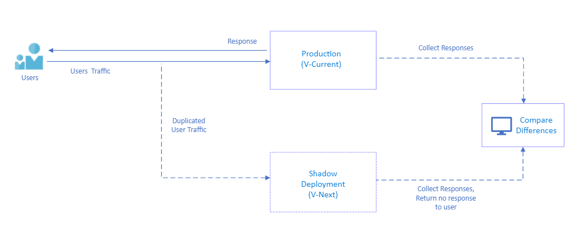
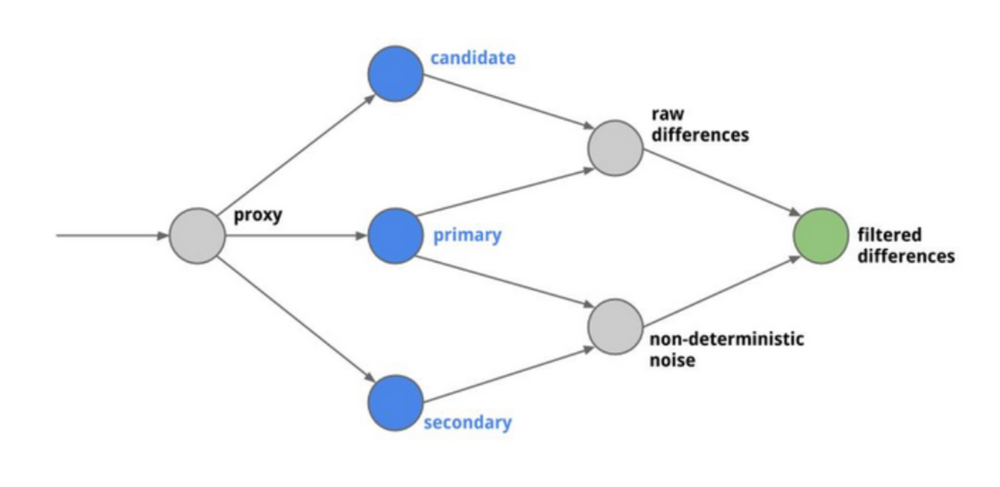

# Shadow Testing

Shadow testing is one approach to reduce risks before going to production. Shadow testing is also known as "Shadow Deployment" or "Shadowing Traffic" and similarities with "Dark launching".

## When to use

Shadow Testing reduces risks when you consider replacing the current environment (V-Current) with candidate environment with new feature (V-Next). This approach is monitoring and capturing differences between two environments then compare and reduces all risks before you introduce a new feature/release.

In our test cases, code coverage is very important however sometimes providing code coverage can be tricky to replicate real-life combinations and possibilities. In this approach, to test V-Next environment we have side by side deployment, we're replicating the same traffic with V-Current environment and directing same traffic to V-Next environment, the only difference is we don't return any response from V-Next environment to users, but we collect those responses to compare with V-Current responses.

 Referencing back to one of the Principles of Chaos Engineering, mentions importance of sampling real traffic like below:

> Systems behave differently depending on environment and traffic patterns. Since the behavior of utilization can change at any time, sampling real traffic is the only way to reliably capture the request path. To guarantee both authenticity of the way in which the system is exercised and relevance to the current deployed system, Chaos strongly prefers to experiment directly on production traffic.

With this Shadow Testing approach we're leveraging real customer behavior in V-Next environment with sampling real traffic and mitigating the risks which users may face on production. At the same time we're testing V-Next environment infrastructure for scaling with real sampled traffic. V-Next should scale with the same way V-Current does. We're testing actual behavior of the product and this cause zero impact to production to test new features since traffic is replicated to V-next environment.

There are some similarities with [Dark Launching](https://martinfowler.com/bliki/DarkLaunching.html), Dark Launching proposes to integrate new feature into production code, but users can't use the feature. On the backend you can test your feature and improve the performance until it's acceptable. It is also similar to [Feature Toggles](https://martinfowler.com/bliki/FeatureToggle.html) which provides you with an ability to enable/disable your new feature in production on a UI level. With this approach your new feature will be visible to users, and you can collect feedback. Using Dark Launching with Feature Toggles can be very useful for introducing a new feature.

## Applicable to

- **Production deployments**: V-Next in Shadow testing always working separately and not effecting production. Users are not effected with this test.
- **Infrastructure**: Shadow testing replicating the same traffic, in test environment you can have the same traffic on the production. It helps to produce real life test scenarios
- **Handling Scale**: All traffic is replicated, and you have a chance to see how your system scaling.

## Shadow Testing Frameworks and Tools

There are some tools to implement shadow testing. The main purpose of these tools is to compare responses of V-Current and V-Next then find the differences.

- [Diffy](https://github.com/opendiffy/diffy)
- [Envoy](https://www.envoyproxy.io)
- [McRouter](https://github.com/facebook/mcrouter)
- [Scientist](https://github.com/github/scientist)

One of the most popular tools is [Diffy](https://github.com/opendiffy/diffy). It was created and used at Twitter. Now the original author and a former Twitter employee maintains their own version of this project, called [Opendiffy](https://github.com/opendiffy/diffy). Twitter announced this tool on their engineering blog as "[Testing services without writing tests](https://blog.twitter.com/engineering/en_us/a/2015/diffy-testing-services-without-writing-tests.html)".

As of today Diffy is used in production by Twitter, Airbnb, Baidu and Bytedance companies. Diffy explains the shadow testing feature like this:

> Diffy finds potential bugs in your service using running instances of your new code, and your old code side by side. Diffy behaves as a proxy and multicasts whatever requests it receives to each of the running instances. It then compares the responses, and reports any regressions that may surface from those comparisons. The premise for Diffy is that if two implementations of the service return “similar” responses for a sufficiently large and diverse set of requests, then the two implementations can be treated as equivalent, and the newer implementation is regression-free.

Diffy architecture

## Conclusion

Shadow Testing is a useful approach to reduce risks when you consider replacing the current environment with candidate environment using new feature(s). Shadow testing replicates traffic of the production to candidate environment for testing, so you get same production use case scenarios in the test environment. You can compare differences on both environments and validate your candidate environment to be ready for releasing.

Some advantages of shadow testing are:

- Zero impact to production environment
- No need to generate test scenarios and test data
- We can test real-life scenarios with real-life data.
- We can simulate scale with replicated production traffic.

## References

- [Martin Fowler - Dark Launching](https://martinfowler.com/bliki/DarkLaunching.html)
- [Martin Fowler - Feature Toggle](https://martinfowler.com/bliki/FeatureToggle.html)
- [Traffic Shadowing/Mirroring](https://istio.io/latest/docs/tasks/traffic-management/mirroring/#:~:text=Traffic%20mirroring%2C%20also%20called%20shadowing,path%20for%20the%20primary%20service.)
