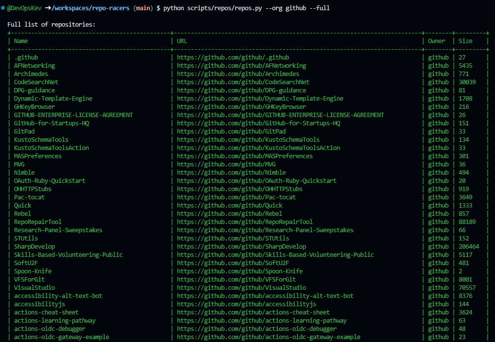

# GitHub Repository List Script

This script lists repositories in a GitHub organization. It can print a full list of repositories or a filtered list that only includes repositories whose URLs match a specific pattern.

## Prerequisites

You need to have Python installed on your machine to run this script. You also need to install the `PyGithub`, `prettytable`, and `termcolor` packages. You can install it with pip:

```bash
pip install PyGithub prettytable termcolor
```

## Usage

You can run the script with command-line arguments like this:

```bash
python repos.py --token your_token --org your_org --pattern your_pattern --full --filtered
```


Each argument is optional:

`--token`: The GitHub token. If you don't provide this argument, the script will try to read it from the `GITHUB_ADMIN_TOKEN` environment variable. If both the `--token` argument and the `GITHUB_ADMIN_TOKEN` environment variable are set, the `--token` argument will take priority.

`--org`: The GitHub organization. This argument is required. If you don't provide this argument, the script will throw an error.

`--pattern`: The pattern to match repository URLs. If you don't provide this argument, the script will use `".*"` as the default value, which matches all repository URLs.

`--full`: If this argument is provided, the script will print the full list of repositories.

`--filtered`: If this argument is provided, the script will print the filtered list of repositories.

### Example

Here's an example of how to run the script:

```bash
python repos.py --token abc123 --org my-org --pattern "https://github\.com/my-org/my-repo-\w+" --full --filtered

```

This command will print the full list of repositories and the filtered list of repositories in the "my-org" organization that match the pattern "https://github.com/my-org/my-repo-\w+".


Remember to replace your_token, your_org, and your_pattern with your actual GitHub token, your GitHub organization, and your pattern, respectively.

